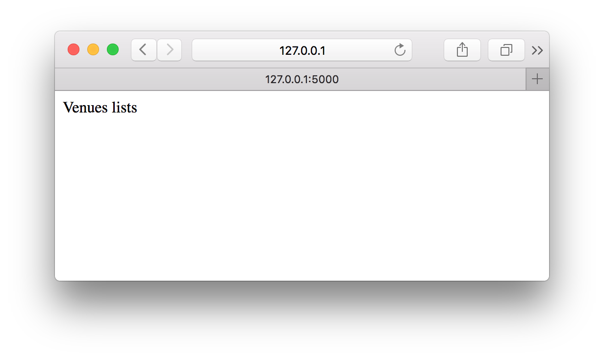
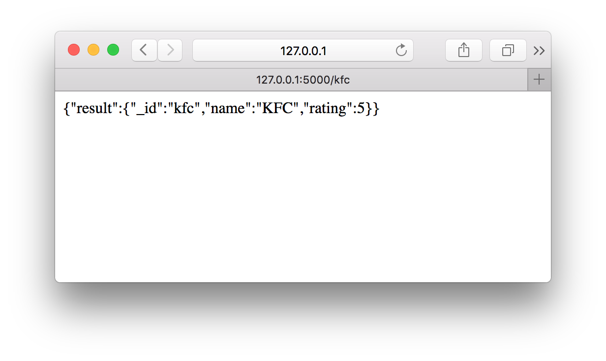
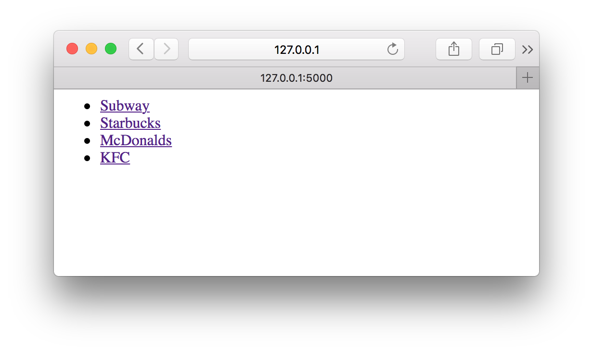
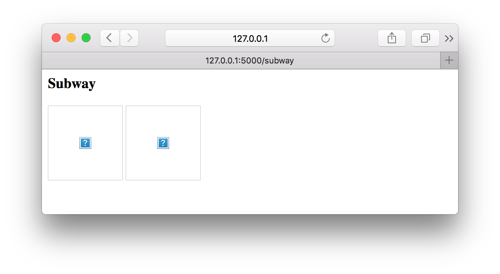
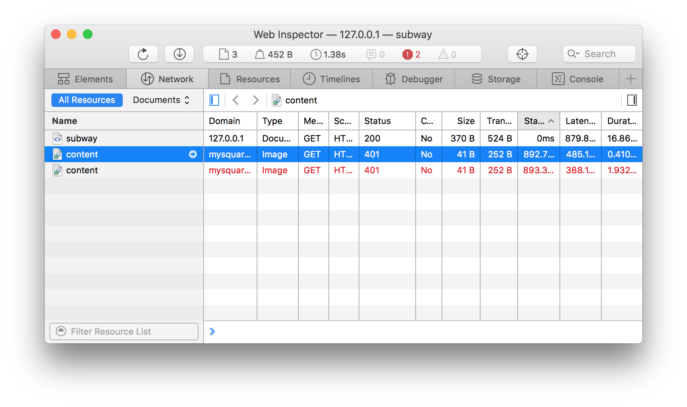

## Setup

This quickstart assumes you have a working installation of [Deform cli](/cli/).
To verify cli is installed, use the following command:

    $ deform info

If you get `deform: command not found` you must install the CLI by
[following instructions](/cli/#installation). If you're a mac user you can install
it with `brew`:

    $ brew install deform-cli

## Registration

If you are new to Deform you must create an account.
Provide an initial project with the name and the identifier:

    $ deform account create -e email@example.com -p mypassword \
          --project-name 'My mysquare' \
          --project-id 'mysquare'

!!! note
    Be careful with the `--project-id`.
    It should be unique across the all Deform projects (even if it doesn't belong to your account!).
    If you have some conflict errors just set the project's id as `mysquare1`, `mysquare2`, etc...

When you create the account you automatically become logged in.

    $ deform account

Let's look at the `mysquare` project info:

    $ deform get mysquare

If you created the project with the id `mysquare3000` then use it:

    $ deform get mysquare3000

We will use `mysquare` project id through all the documentation. Just don't forget
to use your own id.

## Collections

Deform follows the [MongoDB](https://docs.mongodb.org/manual/reference/glossary/) paradigm
and operates over `collections` and `documents`. To see what collections are already in
project you can type command with `get <project-id>.collections` pattern:

    $ deform get mysquare.collections

```json
[  
  {  
    "_id": "_files",
    "name": "Files",
    "schema": ...,
    "indexes": ...,
    ...
  },
  ...
]
```

We intentionally shortened response because by default this command returns
name, schema, indexes and other information.

We can ask to show only the fields we want to see:

    $ deform get mysquare.collections --fields name

```json
[  
  {  
    "_id": "_files",
    "name": "Files"
  },
  {
    "_id": "_tokens",
    "name": "Tokens"
  },
  {
    "_id": "_hooks",
    "name": "Hooks"
  },
  {
    "_id": "_hooks_history",
    "name": "Hooks history"
  },
  {
    "_id": "_notifications",
    "name": "Notifications"
  }
]
```

Every project in Deform contains system collections which names starts with `_` prefix.
You can not remove them. [Read more about system collections](/collections/#system-collections).

## Documents

Let's create a document in a collection called `venues`:

    $ deform create mysquare.collections.venues.documents name=Starbucks

```json
{
  "_id": "56bcbb310640fd0be9fdba88",
  "name": "Starbucks"
}
```

We don't have to create the collection before inserting documents. If there is no collection
`venues` in the project it will be created automatically.

If you don't provide `_id` for the document it will be generated. `_id` is the only
system field. It should be unique and can not be changed. We can remove the document
and recreate it with a custom id:

```
$ deform remove mysquare.collections.venues.documents.56bcbb310640fd0be9fdba88
$ deform create mysquare.collections.venues.documents \
    _id=starbucks \
    name=Starbucks
```

```json
{
  "_id": "starbucks",
  "name": "Starbucks"
}
```

[Read more about documents](/documents).


## Schema

Deform doesn't force you to use a schema for the documents in any collection. This
is the power of the nosql databases.
You can insert a venues without the `name` property but with a `rating` property:

```
$ deform create mysquare.collections.venues.documents \
    _id=mcdonalds \
    rating:=5
```

```json
{
  "_id": "mcdonalds",
  "rating": 5
}
```

But what if you want the `name` property to be mandatory? That's where you can change
the schema of the `venues` collection.
Deform uses [JSON schema](http://json-schema.org/) and by default it allows you to insert
any properties. Let's look at the `venues` collection schema:

    $ deform get mysquare.collections.venues.schema

```json
{  
  "type": "object",
  "properties": {},
  "additionalProperties": true
}
```

Providing `additionalProperties` is `true` you are not limited to use any properties.

Let's make the `name` property required:

```
$ deform update --partial mysquare.collections.venues.schema \
    properties.name:='{"type": "string", "required": true}'
```

```json
{  
  "type": "object",
  "properties": {
    "name": {
      "type": "string",
      "required": true
    }
  },
  "additionalProperties": true,
}
```

Let's try to create a venue without the `name` property:

```
$ deform create mysquare.collections.venues.documents \
    _id=kfc \
    rating:=5
```

```json
{  
  "error": [
    {
      "property": "name",
      "message": "required"
    }
  ]
}
```

Oops. Validation error. That's what we've expected. Let's provide the `name`:

```
$ deform create mysquare.collections.venues.documents \
    _id=kfc \
    name=KFC \
    rating:=5
```

```json
{
  "_id": "kfc",
  "name": "KFC",
  "rating": 5
}
```

The document've been successfully created. You could be curious what've happened with
the `mcdonalds` venue? Actually nothing, it's still in the `venues` collection:

    $ deform get mysquare.collections.venues.documents

```json
[
  {
    "_id": "starbucks",
    "name": "Starbucks"
  },
  {
    "_id": "mcdonalds",
    "rating": 10
  },
  {
    "_id": "kfc",
    "name": "KFC",
    "rating": 5
  }
]
```

Deform doesn't force you to migrate existing documents when the collection's schema is changed.
But when you try to update a document you will be asked to provide the required property:

```
$ deform update --partial mysquare.collections.venues.documents.mcdonalds \
    rating:=6
```

```json
{  
  "error": [
    {
      "property": "name",
      "message": "required"
    }
  ]
}
```

Let's set the name for McDonalds:

```
$ deform update --partial mysquare.collections.venues.documents.mcdonalds \
    name=McDonalds
```

```json
{
  "_id": "mcdonalds",
  "name": "McDonalds",
  "rating": 10
}
```

[Read more about schemas](/schemas).


## Files

Our `venues` collection contains venues with the names but that is not enough.
Let's add some photos!

Deform operates with files like with any data.
Let's add an array property which will contain all the venue photos:

```
$ deform update --partial mysquare.collections.venues.schema \
    properties.photos:='{"type": "array", "items": {"type": "file"}}'
```

```json
{  
  "type": "object",
  "properties": {
    "name": {
      "type": "string",
      "required": true
    },
    "photos": {
      "type": "array",
      "items": {
        "type": "file"
      }
    }
  },
  "additionalProperties": true,
}
```

Providing directory `/photos/` on your local machine contains two photos:

**1.jpg**


**2.jpg**


Let's create a new venue:

```
$ deform create mysquare.collections.venues \
    _id=subway \
    name=Subway \
    photos@/photos/1.jpg \
    photos@/photos/2.jpg
```

```json
{
  "_id": "subway",
  "name": "Subway",
  "photos": [
    {
      "_id": "55bcab67a44765000a000031",
      "collection_id": "venues",
      "content_type": "image/jpeg",
      "date_created": "2016-02-01T11:20:07.141Z",
      "document_id": "subway",
      "last_access": "2016-02-01T11:20:07.141Z",
      "md5": "bfcd3c186b72829a7eab15e3469d2958",
      "name": "1.jpg",
      "size": 3191459
    },
    {
      "_id": "66bcab67a44766000a000031",
      "collection_id": "venues",
      "content_type": "image/jpeg",
      "date_created": "2016-02-01T11:20:08.141Z",
      "document_id": "subway",
      "last_access": "2016-02-01T11:20:08.141Z",
      "md5": "cfcd3c186c72829a7eac15e3469d2958",
      "name": "2.jpg",
      "size": 4191459
    }
  ]
}
```

Every item in `photos` attribute contains information about saved files.
Let's get a content of the first image:

    $ deform get mysquare.collections.venues.subway.photos.0.content > download.jpg

If you open downloaded image you will see the original `1.jpg`:

**download.jpg**


[Read more about files](/files).


# Website

Let's build a small website with two pages:

* List page of the all venues
* Detail page of the one venue

We will use python with [Flask](http://flask.pocoo.org/) and [requests](http://docs.python-requests.org/en/master/). Install both packages first:

    $ pip install Flask requests

Let's create a `mysquare.py` file and write some code:

```python
{!docs/quickstart/examples/001/code/mysquare.py!}
```

Run the site:

    $ python mysquare.py
    * Restarting with fsevents reloader
    * Debugger is active!
    * Debugger pin code: 120-616-853

Website should be running on you local machine.

Open address [http://127.0.0.1:5000/](http://127.0.0.1:5000/) in your web browser. You should see the venues list page:



If you open [http://127.0.0.1:5000/hello](http://127.0.0.1:5000/hello) in your web browser you should see
the venue detail page:


## Retrieving the venues

We know how to retrieve the documents from the collections using Deform CLI.
For retrieving the venues for the website we will use Deform's [HTTP API](/http-api-reference/).

For retrieving documents from the projects collection you must make the `GET` HTTP
request for url compound by next pattern:

```text
https://<project-id>.deform.io/api/collections/<collection-id>/documents/
```

Let's try to make the HTTP request inside the `venues_list` function.

```python
{!docs/quickstart/examples/002/code/mysquare.py!}
```

Let's try to open [http://127.0.0.1:5000](http://127.0.0.1:5000) again. You should see something like this:


We got `401 UNAUTHORIZED` response code. Why did it happen?

Deform does not allow to work with the project data without authorization.
When you've been using CLI you were authorized with login and password.
How to authorize our website application? Let's create a token.

## Creating a token

If you want to authorize any client making changes or retrieving data from any
project you must create the [authorization token](/tokens). Let's create the token
and allow the clients using this token to read the documents from the `venues` collection:

```
$ deform create mysquare.collections.tokens.documents \
    _id=TFWaTgjB \
    name="Read venues" \
    permissions.allow.read:='{"what": "document", "where": "venues"}'
```

```json
{
  "_id": "TFWaTgjB",
  "name": "Read venues",
  "is_active": true,
  "permissions": {
    "allow": {
      "read": {
        "what": "document",
        "where": "venues"
      }
    }
  }
}
```

You can check the token with CLI providing `--auth-token` flag:

```
$ deform get mysquare.collections.venues.documents \
    --auth-token TFWaTgjB
```

```json
[
  {
    "_id": "starbucks",
    "name": "Starbucks"
  },
  {
    "_id": "mcdonalds",
    "name": "McDonalds",
    "rating": 10
  },
  {
    "_id": "kfc",
    "name": "KFC",
    "rating": 5
  },
  {
    "_id": "subway",
    "name": "Subway",
    "photos": [
      {
        "_id": "55bcab67a44765000a000031",
        "collection_id": "venues",
        "content_type": "image/jpeg",
        "date_created": "2016-02-01T11:20:07.141Z",
        "document_id": "subway",
        "last_access": "2016-02-01T11:20:07.141Z",
        "md5": "bfcd3c186b72829a7eab15e3469d2958",
        "name": "1.jpg",
        "size": 3191459
      },
      {
        "_id": "66bcab67a44766000a000031",
        "collection_id": "venues",
        "content_type": "image/jpeg",
        "date_created": "2016-02-01T11:20:08.141Z",
        "document_id": "subway",
        "last_access": "2016-02-01T11:20:08.141Z",
        "md5": "cfcd3c186c72829a7eac15e3469d2958",
        "name": "2.jpg",
        "size": 4191459
      }
    ]
  }
]
```

If you try to retrieve data from the other collection or create a document in the
`venues` collection you will get the authorization error:

```
$ deform create mysquare.collections.venues.documents \
    --auth-token TFWaTgjB \
    _id=pizzahut \
    name=Pizza hut
```

```json
{
  "error": "Forbidden"
}
```

Let's use the token for retrieving document with HTTP API. You must provide
`Authorization` header with value compound by template `Token <token-id>`:

```python
{!docs/quickstart/examples/003/code/mysquare.py!}
```


Cool, we've retrieved all the documents from the `venues` collection.

The final step would be to retrieve a venue document for the venue detail view.
We should add some logic to `venue_detail` function:

```python
{!docs/quickstart/examples/004/code/mysquare.py!}
```

If you visit [http://127.0.0.1/kf](http://127.0.0.1/kf) you will get `404` error because there is no
venue with `_id` equals `kf`:


But there is the venue with `_id` equals `kfc` on page [http://127.0.0.1/kfc](http://127.0.0.1/kfc):



## Creating templates

We've finished with retrieving data from Deform and now let's add templates
for rendering HTML pages.

```python
{!docs/quickstart/examples/005/code/mysquare.py!}
```

`response.json()` function converts json from response to the python's native object.
This object will be used inside the templates. Let's add the template for the venues list:

**templates/venues_list.html**

```html
{!docs/quickstart/examples/005/code/templates/venues_list.html!}
```

If you open index page of the website you will see a list of the links for the
every venue detail page:



Let's add the venue detail template:

**templates/venue_detail.html**

```html
{!docs/quickstart/examples/005/code/templates/venue_detail.html!}
```

Open the [http://127.0.0.1:5000/subway](http://127.0.0.1:5000/subway) page:



As you remember it's possible to get file's content with CLI. For retrieving
file's content with HTTP API you can build a full url by next pattern:

```
https://<project-id>.deform.io/api/collections/<collection-id>/documents/<document-id>/<path-to-file-property>/content/
```

Why don't we see the images on the venue page? Let's look at the developer console:



You should remember that Deform does not allow to work with the project data without authorization.
Browser is yet another client that should authorize it's requests to the HTTP API.
It's possible to send authorization token with `token` query parameter. For example:

```
https://<project-id>.deform.io/.../content/?token=<token>
```

Let's send the token to the template context:

```python
{!docs/quickstart/examples/006/code/mysquare.py!}
```

Use the token in image's content url:

**templates/venue_detail.html**

```html
{!docs/quickstart/examples/006/code/templates/venue_detail.html!}
```

## Todo:

* Image resize processors
* Reprocess images (for subway)
* Geolocation
* Search:
    * By name
    * By compound field (with template processors)

show on map
show location near venue (on detail page)
